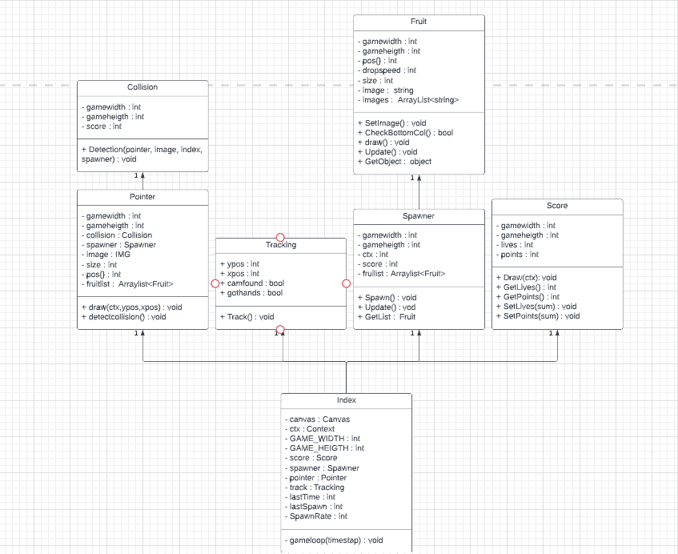
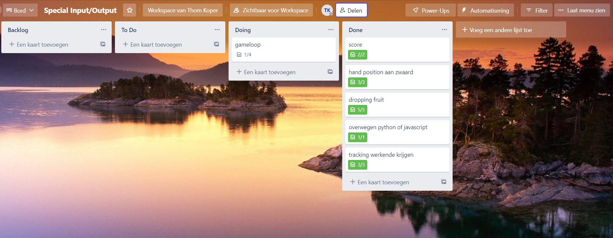

# Special Input and Output

Dit is Thom Koper zijn special input en output project, in dit project maken ik gebruik van een door een bedrijf getrained machine learning AI model om een fruit ninja game te besturen 


- # Onderzoek
    ## Scope

    - Mijn idee van een camera met hand tracking gebruiken is zeer haalbaar en ookal veel vaker gedaan. Er zijn al heel veel projecten die dit gebruiken op allemaal verschillende manieren. Ze hebben dit gedaan door een AI model te gebruiken die getrained is om handen te herken en te volgen en de coördinaten te geven. ook is het makkelijk uittestbaar door bijvoorbeeld de tracking op te zetten en iets de positie te laten volgen. De kern van het idee is dus hand tracking gebruiken als game controller. Dit is haalbaar, klein genoeg en toch nog uitdagend 

    ## Cost

    - het kost niks behalve als je geen camera heb op je pc of laptop, dan zou je een moeten aansluiten. Maar voor dit project heb ik zelf een beschikbare camera om de features mee uit te testen. De camera en laptop zijn essentieel. Wat ik moet doen om me doel te bereiken is bekend worden met de mediapipe api en bekend worden met het maken van een game in javascript. ook moet ik leren om mediapipe en javascript samen te laten werken 

    ## Scedule

    - De meeste prioriteit is aan het bekend worden met mediapipe en javascript en dan ook de handtracking toepassen in een test dit duurt me 1 week. daarna het samen laten werken van de game en de handtracking, dit duur me ongeveer 1 week. Dan duurt het me 2 weken om de fruit ninja te maken.

    ## Brainstorm

    1. turn picture's from your phone into normal maps and bump maps and height maps

    - input: camera telefoon, camera laptop


    - niet gekozen omdat: dit niet het soort input output project is waar ik aan wil beginnen. en de input is niet heel special.


    2. motion controlls:
    - leapmotion op vr headset (goed gemaakt voor hand tracking, makkelijk op headset te bevestigen, klein en licht, accuraat)
    - kinect (reden waarom niet is omdat het niet goed gaat werken voor het doel wat ik wil en dat is in vr je eigen handen hebben want de kinect is niet echt portable en makkelijk op te zetten, niet accuraat voor handtracking)
    - laptop camera (reden waarom niet is omdat het ook niet goed is voor het doel, niet heel portable, en accuraat voor hand tracking)
    - vr controller(fruit ninja)(kan ook met leapmotion)
    - gekozen omdat: motion tracking iets is wat ik al heel lang wil doen, en je hebt heel veel kanten om op te gaan met deze keuze


    3. amazon alexa gebruiken om met audio iets te doen

    - (waarom niet google home)
    - (waarom niet apple pod)
    - (waarom niet voice herkening van laptop)

    - niet gekozen omdat: het bestellen van een van de smart devices zal te lang duren en te veel tijd innemen van het project

    ## Onderzoeks beschrijving
    
    - het onderzoeken van dit project heeft me tot veel ideeën gebracht. Ik ben begonnen met al die ideeën op te schrijven in een [brainstorm document](https://github.com/schlorp/SpecialIO/blob/main/BrainStorm.txt). van al die ideeën heb ik op bassis van haalbaarheid en relevantie voor het project een idee uitgekozen. Na het gekozen te hebben van een idee ben ik verschillende soorten input mogelijkheden gaan vergelijken met elkaar:

    	| input device | + | - |
        | ----------- | ----------- | ----------- |
        | leapmotion | Accurate tracking, Mountable op een vr, Small, Goede api en uitgebreid, Hand motions| Duur, niet meer beschikbaar |
        | kinect | Redelijke tracking, Makkelijk op te zetten, Full body tracking, Redelijke prijs | Xbox one versie niet op pc, lang tot inhuis |
        | camera | genoeg api's beschikbaar, veel tutorials, dit soort projecten zijn vaker gedaan, goedkoop, niks extern nodig | minder accurate tracing, slechte tracking bij weinig licht |

    door al de min punten en plus punten te overwegen ben ik uiteindelijk gegaan voor de camera omdat: het geen geld kost, kost geen tijd om te bestellen, beschikbaar voor meerdere mensen en omdat er veel info beschikbaar is. ook heb ik hier nog nooit mee gewerkt en wil ik het graag leren, ik ga dit project ook doen in javascript hier heb ik weinig ervaring mee. Dus ik kan er heel veel van leren

    ## Go or no go presentatie
    
    
    
    
    

- # Technisch design document

    ## software
    - ik heb besloten om me eigen kleine engine te maken voor dit project
    - Reden: de reden is omdat ik er dan veel meer van leer en nieuwe skills erbij krijg. ook lijkt het me makkelijker dan eerst alles in een engine weten te krijgen
    - nadeel: een nadeel is dat dit wel een stuk tijd kost

    ## IDE
    - Code editor: Visual Studio Code, heb deze editor gekozen omdat ik er ervaring mee heb en hij werkt heel goed samen met HTML, CSS en Javascript

    ## talen
    - de talen die ik ga gebruiken zijn: HTML, CSS, Javascript
    - de voordelen aan deze talen zijn dat ik mijn game op websites kan weergeven, ook werkt de mediapipe api hier goed mee samen 

    ## UML
    

    ## bronnen
    - [de website van de mediapipe api](https://google.github.io/mediapipe/solutions/hands.html)
- # Experimenting
    ik heb voor javascript een tutorial gevolgd over gamedevelopment, hier heb ik 1 dag aan besteed en heb ik heel veel van geleerd. Hier door heb ik dus een extra klein projectje staan met een ping pong en een paddle. Deze game maken was essentieel tot het succes van het project. Door dit projectje heb ik veel geleerd over classes, variablen, draw functies, en exporten. heb hem niet af gemaakt, heb alleen het essentiele gedaan

    [het projectje](https://30997.hosts1.ma-cloud.nl/Javascript%20game%20research/index.html)
- # Mechanics

    ## Random object spawner
    dit stuk van code spawned objecten op een random plek
    ```
    Spawn(){
        //spawn a fruit on a random pos.x and store it in a array
        let spawnpos = Math.floor(Math.random() * this.gamewidth);
        let fruit = {instance: new Fruit(this.gamewidth, this.gameheigth), spawnpos,};

        //checking if not spawned outside of the canvas
        if(spawnpos + fruit.instance.size > this.gamewidth){
            this.Spawn();
        }
        if(spawnpos + fruit.instance.size < this.gamewidth){
            this.fruitlist.push(fruit);
            fruit.instance.SetImage();
            fruit.instance.draw(this.ctx, spawnpos);
        }
    }
    ```
    ## Random image selecter
    dit stuk code zorgt ervoor dat het object een random image krijgt
    ```
    SetImage(){
        //loop thru the images and grab a random one
        let arraylength = this.images.length;
        let random = Math.floor(Math.random() * arraylength);
        
        for(let i = 0; i < arraylength; i ++){
            if(i == random){
                this.image = this.images[i];
            }
        }
        return 0;
    }
    ```

- # testing
    11-4--2022:
    test1(

    probleem: er worden meer objecten verwijderd uit de array als je 1 object kapot slaat


    hypotese: dit ligt aan de manier van verwijderen en de opzet van de array, of tewel elk obejct word een index verschoven en dat handelt hij verkeerd,
    vooral als ik een object sla boven andere objecten

    test: ik ga debuggen met console logs, en ga ondertussen proberen de bug te repliceren 

    uitslag: ik heb vast gesteld dat mijn hypotese correct is als ik het bovenste object sla en vernietig gaan de object daar onder ook kapot

    )

    test2(

    probleem: er worden meer objecten verwijderd uit de array als je 1 object kapot slaat

    hypotese: ik heb de manier van het verwijderen van het object uit de array aangepast en heb aan gepast dat hij niet het object aanpast maar de index
    daar lag het probleem denk ik

    test: ik ga wachten tot er genoeg objecten op het scherm zijn en ik ga het bovenste object slaan

    uitslag: mijn hypotese was correct, het programma verwijderd nu correct het object uit de array zonder alles daar onder er ook uit te halen 


    )

- # Trello en gitub
    - [de Trello](https://trello.com/thomkoper/boards)
        
    - [de Github](https://github.com/schlorp/SpecialIO)

        

- # Product

    - [het product](https://30997.hosts1.ma-cloud.nl/BOGame/index.html)
    - ik adviseer als je een adblocker hebt hem uit te zetten anders werkt het programma niet


- # Bronnen


    - [de website van de mediapipe api](https://google.github.io/mediapipe/solutions/hands.html)
    - [een vergelijking van een kinect en een leapmotion](https://www.quora.com/Which-one-is-better-Kinect-SoftKinectic-or-Leap-Motion)
    - [een video over het maken van een game in javascript](https://www.youtube.com/watch?v=3EMxBkqC4z0)
    - [een video over het gebruiken van de coördinaten van de hand](https://www.youtube.com/watch?v=BX8ibqq0MJU)

